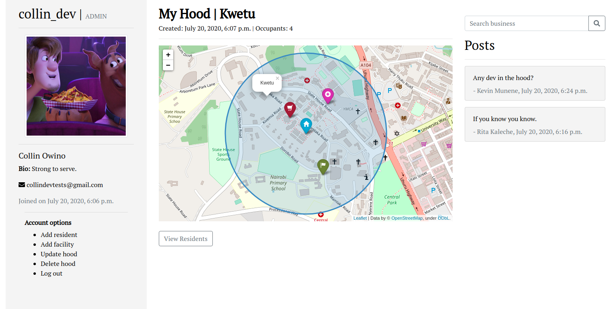

# HoodMap
#### A neighbourhood map for residents of a particular place, 20/07/2020
#### By [Collin Owino](https://github.com/Collin9726)

### [HoodMap app](https://hoodmapdev.herokuapp.com/)

## Description

<table>
<tr>
<td>
HoodMap is an app for residents of a particular place. A neighbourhood admin signs up for an account on HoodMap and registers their neighbourhood. The admin is responsible for adding residents, who on addition receive via email temporary login credentials to their user accounts. The admin also updates the neighbourhood with locations and contacts of important facilities like healthcare centers and police stations. 
  
Residents can add businesses to their neighbourhood giving the location, description and contact. They can also make posts visible to everyone in their neighbourhood.
</td>
</tr>
</table> 

#### Latest updated version is on 20th July 2020.

## Technologies used

1. Python v3.6
2. Django 3.0.7
3. AWS S3 buckets
4. Postgres
5. Folium
6. Django-Mapbox
7. HTML & CSS

## Development

The app has been developed with Django 3.0.7. It is hosted on Heroku cloud platform and makes use of PostgreSQL database for app data while AWS S3 buckets store static and media files. The app uses dependencies as listed on `requirements.txt`. It's source code is available on GitHub at https://github.com/Collin9726/MyMap

## Setup & Run instructions
- Clone the repo to your machine
- Create and activate a virtual environment
- Install the dependencies listed on `requirements.txt`.
- Include a `.env` file that provides `SECRET_KEY`, `AWS_ACCESS_KEY_ID`, `AWS_SECRET_ACCESS_KEY` among other environment variables as listed in `.env.sample`
- Run your app on `MODE='dev'` config for debugging purposes.

To contribute to this project on any modules, follow these easy steps:

- Fork the repo
- Create a new branch in your terminal (git checkout -b improve-feature)
- Make appropriate changes in file(s)
- Add the changes and commit them (git commit -am "Improve App")
- Push to the branch (git push origin improve-app)
- Create a Pull request

## Support and contact details
For any queries, issues, ideas or concerns contact [Collin Owino](owino.collin@gmail.com). Your feedback is highly appreciated. 
### [License](LICENSE)
MIT license
Copyright (c) 2020 **Collin Owino**